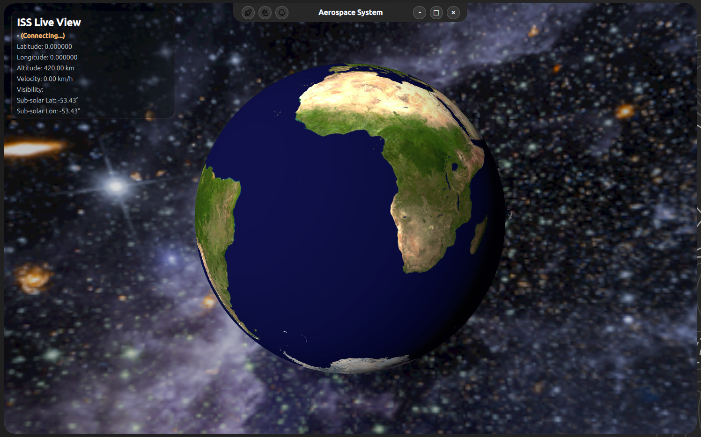

# Aerospace UI

[](https://www.qt.io/)
[](https://cmake.org/)
[](#license)

A desktop application built with Qt Quick and QtQuick3D for visualizing aerospace data, including 3D Earth rendering and satellite representation.

---

## Overview

This project demonstrates a modern QML-based architecture combining 2D UI and 3D visualization. It focuses on performance, modularity, and clean component design.

---

## Screenshots

Application results can be found in the [`docs`](./docs) directory.



---

## Features

- 3D Earth visualization using QtQuick3D  
- Satellite display and positioning  
- Custom reusable UI components  
- Smooth animations and transitions  
- Theme-driven styling  

---

## Requirements

- Qt 6.5 or newer  
- Qt Quick  
- Qt Quick Controls  
- QtQuick3D  
- QtQuick Effects  
- CMake 3.16 or newer  
- OpenGL-compatible GPU  

---

## Build

```bash
mkdir build
cd build
cmake ..
make
./aerospace